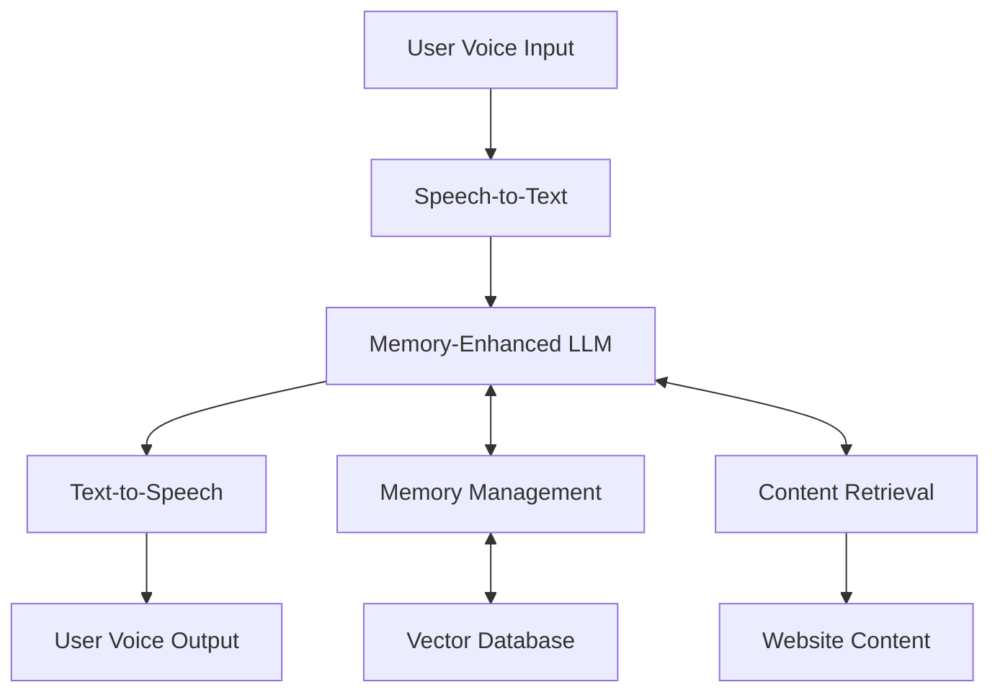

# MemVoice: Memory-Optimized Voice Agent Pipeline

[](https://github.com/username/memvoice/actions)
[](https://opensource.org/licenses/MIT)
[](http://makeapullrequest.com)

A memory-optimized voice agent service that transforms websites and document sets into interactive voice assistants. MemVoice uses advanced memory management techniques to provide efficient, natural voice interactions with minimal token usage.

## 🚀 Quick Start

### Prerequisites

- Node.js 18+ and npm
- Python 3.11+
- Docker (optional, for local development)
- API keys for:
  - OpenAI (Whisper, GPT)
  - ElevenLabs or similar TTS service
  - Pinecone (vector database)
  - Zep (memory management)

### Local Development Setup

1. **Clone the repository**
   ```bash
   git clone https://github.com/username/memvoice.git
   cd memvoice
   ```

2. **Set up environment variables**
   ```bash
   cp .env.example .env
   # Edit .env with your API keys and configuration
   ```

3. **Backend setup**
   ```bash
   cd backend
   python -m venv venv
   source venv/bin/activate  # or `venv\Scripts\activate` on Windows
   pip install -r requirements.txt
   uvicorn src.main:app --reload
   ```

4. **Frontend setup**
   ```bash
   cd frontend
   npm install
   npm run dev
   ```

5. **Access the application**
   - Frontend: http://localhost:3000
   - Backend API: http://localhost:8000
   - API Documentation: http://localhost:8000/docs

## 🏗️ Architecture

MemVoice consists of several integrated components:

- **Memory Management**: Zep-powered memory system with token optimization
- **Voice Processing**: Whisper STT + ElevenLabs TTS pipeline
- **Content Processing**: Website scraping and vectorization
- **Frontend**: Next.js React application
- **Backend**: FastAPI Python service



## 📋 Features

### Current (MVP)
- ✅ Voice-to-voice interaction with websites
- ✅ Memory-optimized token usage (70% reduction)
- ✅ Real-time voice processing
- ✅ Website content extraction and vectorization
- ✅ Simple management dashboard

### Planned (Phase 2)
- 🔄 Multi-language support
- 🔄 Voice persona customization
- 🔄 Advanced analytics
- 🔄 API access for developers
- 🔄 Team collaboration features

## 🛠️ Development

### Tech Stack

**Backend:**
- Python 3.11+ with FastAPI
- Zep for memory management
- Pinecone for vector storage
- OpenAI Whisper for STT
- ElevenLabs for TTS

**Frontend:**
- Next.js 14 with TypeScript
- Tailwind CSS for styling
- React Hook Form for forms
- SWR for data fetching

**Infrastructure:**
- Vercel for frontend hosting
- Railway for backend deployment
- GitHub Actions for CI/CD

### Project Structure

The project is organized as follows:

```
memvoice/
├── src/                # Source code for the project
├── tests/              # Unit and integration tests
├── docs/               # Documentation and project plans
├── .github/            # GitHub configuration and templates
├── .gitignore          # Git ignore rules
├── README.md           # Project overview and instructions
├── CONTRIBUTING.md     # Contribution guidelines
```

## Directory Descriptions
- **src/**: All main source code for the project should go here.
- **tests/**: All test code should go here.
- **docs/**: Documentation, plans, and research files.
- **.github/**: GitHub Actions, issue templates, and pull request templates.

## Getting Started
1. Clone the repository.
2. Install dependencies (if Python: `pip install -r requirements.txt`).
3. Add your source code to `src/` and tests to `tests/`.

## Contributing
See `CONTRIBUTING.md` for guidelines.

## 🧪 Testing

```bash
# Run all tests
npm run test:all

# Backend tests only
cd backend && pytest

# Frontend tests only
cd frontend && npm test

# E2E tests
npm run test:e2e
```

## 📚 Documentation

- [API Documentation](docs/api/README.md)
- [Architecture Guide](docs/architecture/README.md)
- [Deployment Guide](docs/deployment/README.md)
- [User Guides](docs/user-guides/README.md)
- [Development Plan](MEMVOICE_DEVELOPMENT_PLAN.md)

## 🚀 Deployment

### Production Deployment

The application is designed for serverless deployment:

- **Frontend**: Deployed on Vercel
- **Backend**: Deployed on Railway
- **Database**: Supabase PostgreSQL
- **Vector DB**: Pinecone

See [Deployment Guide](docs/deployment/README.md) for detailed instructions.

### Environment Variables

Required environment variables:

```env
# API Keys
OPENAI_API_KEY=your_openai_key
ELEVENLABS_API_KEY=your_elevenlabs_key
PINECONE_API_KEY=your_pinecone_key
ZEP_API_KEY=your_zep_key

# Database
DATABASE_URL=your_database_url

# App Configuration
NEXT_PUBLIC_API_URL=http://localhost:8000
JWT_SECRET=your_jwt_secret
```

## 📊 Monitoring

- **Error Tracking**: Sentry integration
- **Performance**: Built-in monitoring
- **Uptime**: External monitoring service
- **Analytics**: Custom usage tracking

## 🤝 Contributing

We welcome contributions! Please see our [Contributing Guidelines](CONTRIBUTING.md) for details.

### Development Setup for Contributors

1. Fork the repository
2. Create a feature branch
3. Make your changes with tests
4. Submit a pull request

## 📄 License

This project is licensed under the MIT License - see the [LICENSE](LICENSE) file for details.

## 🆘 Support

- **Documentation**: Check our [docs](docs/) directory
- **Issues**: Open a [GitHub issue](https://github.com/username/memvoice/issues)
- **Discussions**: Join our [GitHub discussions](https://github.com/username/memvoice/discussions)

## 🗺️ Roadmap

### Phase 1: MVP (Months 1-4)
- [x] Core voice processing pipeline
- [x] Memory management system
- [x] Basic web interface
- [ ] Beta customer onboarding

### Phase 2: Enhancement (Months 5-8)
- [ ] Multi-language support
- [ ] Advanced analytics
- [ ] Voice customization
- [ ] API access

### Phase 3: Scale (Months 9-12)
- [ ] Enterprise features
- [ ] Advanced integrations
- [ ] Team collaboration
- [ ] White-label solutions

## 📈 Metrics

Current MVP metrics targets:
- Voice processing latency: < 2 seconds
- Memory efficiency: 70% token reduction
- Uptime: 99.5%
- Customer satisfaction: NPS > 50

---

**Built with ❤️ by the MemVoice team** 